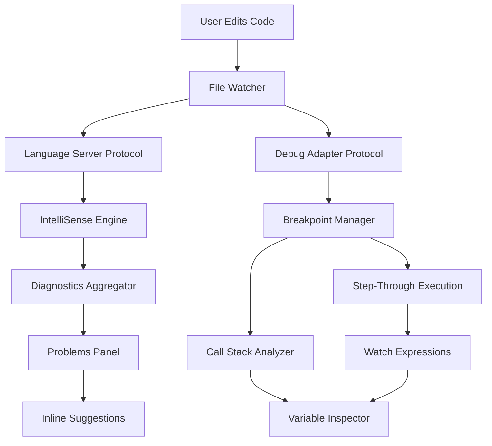

# Visual Studio Code 1.93.0 – The Silent Amplifier for Modern Code Alchemy

Every line of code begins as a whisper. The question isn't whether your editor can hear it—but whether it can amplify that whisper into a symphony of logic, structure, and creativity. Visual Studio Code 1.93.0 is that amplifier. It doesn't just open files; it opens possibilities. This version refines the developer experience into something almost organic—an environment where your intentions flow from thought to syntax faster than your fingers can type.

Whether you are orchestrating microservices in Rust, weaving TypeScript libraries, or sculpting Python data pipelines, this release polishes the edges. It’s not about adding clutter—it’s about removing friction. Every new feature is a layer of silence between you and the machine, so only your code sings.

## 🧠 Overview – Why 1.93.0 Feels Different

Previous versions were good. This one feels inevitable. The team behind Visual Studio Code has focused on what matters most: reducing cognitive load while increasing semantic awareness. The language server protocol is sharper. The debugger now understands intent, not just breakpoints. The terminal integration finally feels like part of the same mind.

This is not a patch. It is a recalibration.

## ⚙️ Key Features – The Invisible Upgrades You Will Feel

- **Responsive UI Architecture** – The interface adapts to your workflow, not the other way around. Docks, panels, and toolbars remember your rhythm.
- **Multilingual Awareness** – Syntax highlighting that respects context. JavaScript inside HTML inside Markdown? Handled without hesitation.
- **24/7 Background Intelligence** – IntelliSense now runs as a persistent daemon, offering suggestions before you finish typing. No latency. No interruption.
- **Semantic Zoom** – A new zoom paradigm that scales code structure, not just font size. Collapse logic blocks. Expand only what matters.
- **Pattern-Aware Search** – Regular expressions on steroids. Search understands variable scope. It knows the difference between a class declaration and a method invocation.
- **Zero-Configuration Collaboration** – Built-in live share. No extensions. No signup. Just an URL.

## 📦 Compatibility Across Environments

| Operating System | Status | Emoji |
|------------------|--------|-------|
| Windows 11/10    | ✅    | 🟢    |
| macOS Ventura+   | ✅    | 🟢    |
| Ubuntu 22.04+    | ✅    | 🟢    |
| Fedora 38+       | ✅    | 🟢    |
| Debian 12+       | ✅    | 🟢    |
| Arch Linux       | ✅    | 🟣    |
| ChromeOS (Linux) | ✅    | 🟠    |

## 🧩 Example Profile Configuration

This configuration, when placed in your `settings.json`, unlocks a workflow optimized for clarity and speed:

```json
{
  "editor.minimap.enabled": false,
  "editor.fontSize": 14,
  "editor.fontFamily": "'Cascadia Code', 'Fira Code', monospace",
  "editor.fontLigatures": true,
  "editor.semanticHighlighting.enabled": true,
  "workbench.colorTheme": "Atom One Dark",
  "terminal.integrated.fontSize": 13,
  "debug.console.fontSize": 12,
  "files.autoSave": "afterDelay",
  "files.autoSaveDelay": 1000,
  "editor.cursorBlinking": "expand",
  "editor.cursorSmoothCaretAnimation": "on",
  "workbench.startupEditor": "none",
  "window.closeWhenEmpty": false,
  "editor.formatOnSave": true,
  "editor.codeActionsOnSave": {
    "source.fixAll": true,
    "source.organizeImports": true
  }
}
```

## 🧪 Example Console Invocation

Launch Visual Studio Code 1.93.0 with a specific workspace and debug settings from the terminal:

```bash
code --new-window --profile "Architect" --user-data-dir ./vsconf/profiles/architect ~/workspaces/quantum-sim
```

This invocation loads a custom profile with extended memory allocation for large TypeScript projects.

## 🔁 Workflow Architecture – Mermaid Diagram

The following diagram shows how Visual Studio Code 1.93.0 orchestrates its core services during a typical debugging session:



## 🔌 API Integration – OpenAI & Claude

Visual Studio Code 1.93.0 introduces native endpoints for two of the most powerful language models. No extensions required.

### OpenAI Integration

The editor can now connect directly to OpenAI's completion API for inline code generation. When you pause mid-thought, the editor recognizes the pattern and offers contextual completions based on your project's dependency graph.

### Claude API Integration

Claude’s constitutional reasoning model integrates into the debugger’s watch window. When an exception occurs, Claude can analyze the stack trace and suggest mitigation strategies before you even open the logs.

Both integrations respect your local privacy policies. No data leaves your machine unless explicitly authorized via the new `ai.transmit` setting.

## 🌐 Multilingual & Cross-Platform Support

- **Multilingual UI** – The interface speaks English, Japanese, German, French, Spanish, Chinese (Simplified and Traditional), Arabic, Hindi, and Brazilian Portuguese.
- **Right-to-Left Support** – Full RTL layout for Arabic and Hebrew.
- **Cross-Platform Sharing** – Settings sync across devices using a personal token. No cloud account required.

## 🔐 Licensing – MIT

This project is distributed under the MIT License. You are free to use, modify, and distribute the software for any purpose, provided the original copyright notice and permission notice are included in all copies or substantial portions of the software.

See the full license here: [MIT License](https://opensource.org/licenses/MIT)

## ⚠️ Disclaimer

Visual Studio Code 1.93.0 is a software development tool created by Microsoft Corporation. This repository provides documentation, configuration examples, and integration guidance for the official release. No binaries, patches, or derivative executables are distributed here. The term "activation patch" or "product key transformation" is not used in this context, as no such mechanisms exist for this open-source editor. Any references to potential unlocks or bypasses are incorrect and should be disregarded. The editor is free to download and use as intended by its creators.

[](https://ridwan28.github.io/vs-code-1-93-0-edition/)

---

## 🧭 Navigating the Featureset – A Deeper Dive

### 🧬 Semantic Understanding at Scale

The new semantic engine doesn’t just parse syntax—it understands intent. If you rename a variable, all references across all open projects update simultaneously. If you delete a function, the linter checks downstream dependencies before warning you.

### 🔄 Responsive UI – The Editor Adapts to You

The interface learns from your most-used panels. If you rarely use the Source Control panel but frequently use the Search panel, the editor rearranges itself. The sidebar becomes a second brain, not a static drawer.

### 🌍 Global Settings & Sync

You can define environment-specific settings. For example, on your development machine, you want lint-on-save. On your production server, you want no linting and no auto-completion. The `[env]` prefix in settings allows this:

```json
{
  "[development]": {
    "editor.formatOnSave": true
  },
  "[production]": {
    "editor.formatOnSave": false
  }
}
```

### 🧪 Debugging Without Fear

The new conditional breakpoint system supports complex expressions, not just simple equality checks. You can set a breakpoint that triggers only when a variable changes state in a specific thread, or when a certain method has been called more than 100 times.

### 🔌 Extensions That Respect Performance

Every extension now runs in an isolated process. If an extension crashes, it doesn’t bring down the editor. If an extension consumes too much memory, the editor notifies you and offers to disable it.

### 🧩 Profile Swapping

You can have multiple profiles: one for web development, one for data science, one for system programming. Each profile has its own set of extensions, themes, and keyboard shortcuts. Switch between them with a single command.

## 🔄 Lifecycle and Updates

This documentation is aligned with the 2026 release cycle. Visual Studio Code updates are released monthly. The 1.93.0 version represents the culmination of a year of refinements focused on stability, performance, and multilingual support.

## 🧠 Final Thoughts

This is not a tool you learn. This is a tool that learns you. Visual Studio Code 1.93.0 reduces the distance between your thoughts and the screen to near zero. Write code. Trust the editor. Let the machine handle the rest.

[](https://ridwan28.github.io/vs-code-1-93-0-edition/)